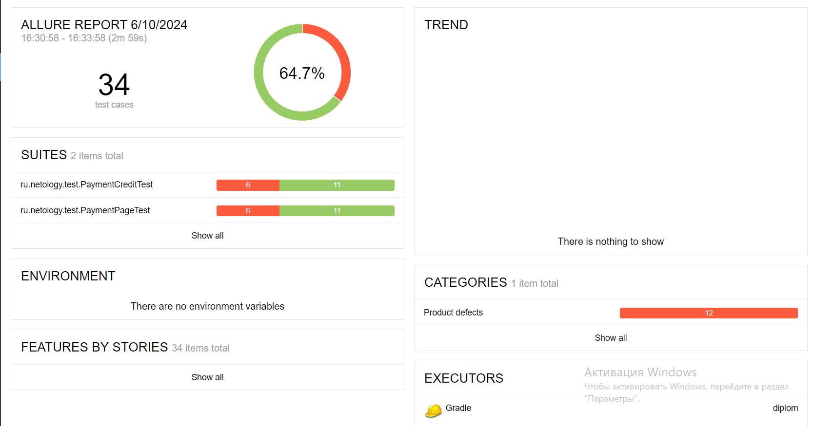
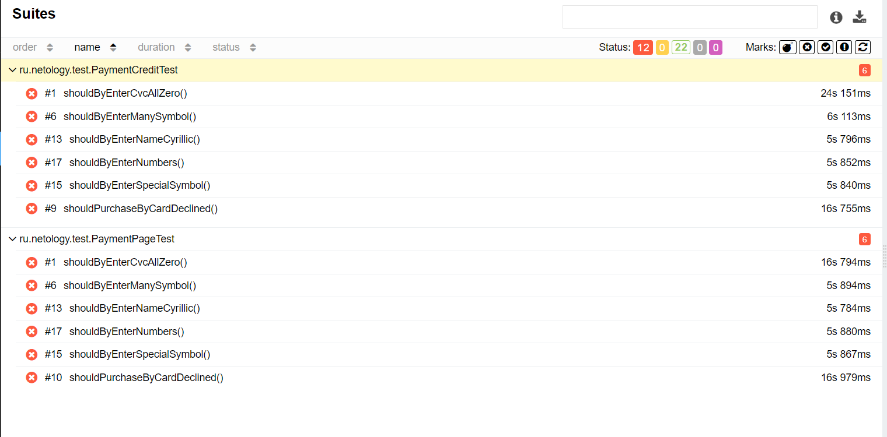
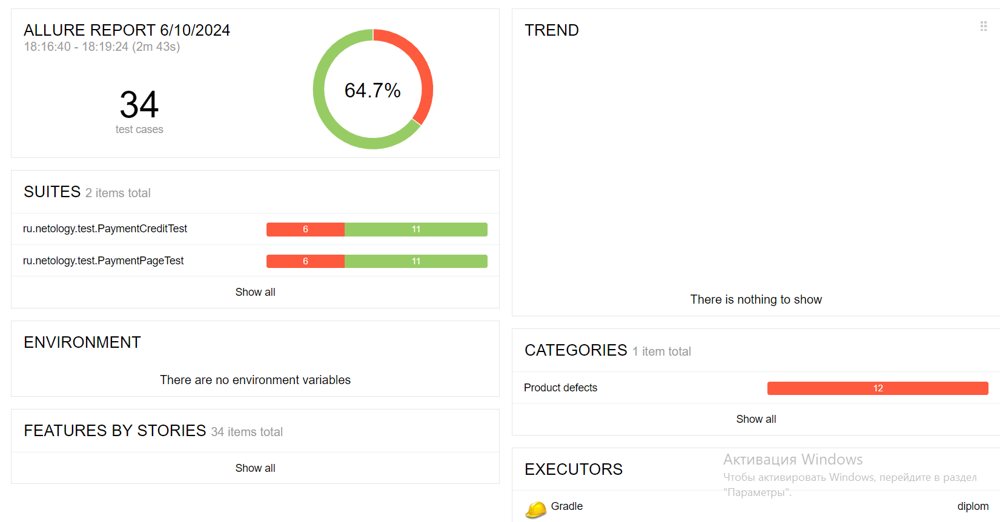
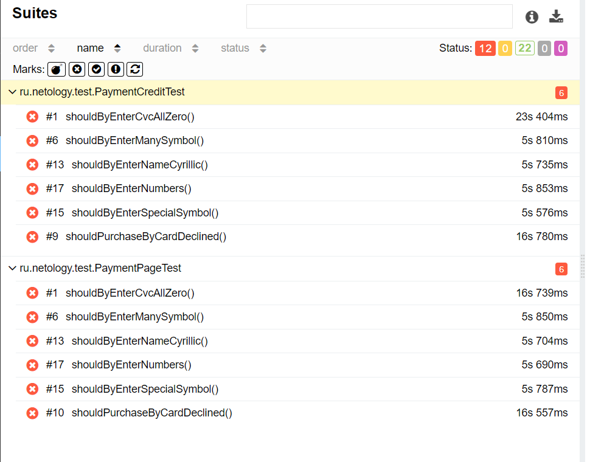

# Отчет о выполнении автоматизированного тестирования.

Количество тест-кейсов:

Общее количество тестовых сценариев 34

При подключении к СУБД MySQL

* 64.7% - тестов пройдено успешно,
* 35.3% - провалены

При подключении к СУБД PostgreSQL

* 64.7% - тестов пройдено успешно,
* 35.3% - провалены
 
В итоге занесено 7 баг-репортов (1 дефект был обнаружен при иследовательском ручном тестировании)
Отчеты можно сгенерировать с помощью Gradle, Allure командой
./gradlew clean test --info и затем после заверешения ./gradlew allureserve

Общие рекомендации:

- Сделать кнопку "Продолжить" не активной до момента пока все поля не будут заполнены.
- Так же не проработан отказ в оплате с отклоненной карты.
